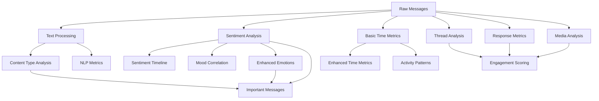

# Doppelganger Analytics - Metrics Specification

This document provides a comprehensive specification of all metrics computed by the Doppelganger Analytics system, including their inputs, outputs, computation methods, and data structures.

## Dashboard Overview Tab

### Current Structure

The Overview tab features a modern, data-rich dashboard design with sophisticated visual hierarchy and comprehensive metric presentation:

#### 1. Hero Metrics Dashboard

**Primary Message Analytics (Large Card)**
- **Total Messages**: Prominent 5xl font display with context
  - Shows average per conversation in dedicated stats box
  - Includes conversation count context
- **Integrated Sub-metrics**: Three embedded cards showing:
  - **Emojis**: Total count with per-message ratio
  - **Participants**: Unique participant count
  - **Response Time**: Average response time with proper calculation
- **Color Scheme**: Blue gradient background with white overlay sections

**Media Overview Card**
- **Total Media**: 4xl font display with breakdown
- **Detailed Breakdown**: Photos, videos, attachments with emoji icons
- **Media Percentage**: Shows percentage of messages containing media
- **Color Scheme**: Purple gradient background

**Communication Style Card**
- **Health Assessment**: Active vs Focused conversation style
- **Engagement Level**: High/Moderate/Low based on emoji usage
- **Response Pattern**: Instant/Quick/Relaxed categorization
- **Color Scheme**: Green gradient background with pill-style indicators

#### 2. Participant Analytics Grid

**Section Header**: "Participant Analytics" with enhanced typography

**Four Sophisticated Analysis Cards:**

**Top Contributors Card**
- **Design**: Rounded-2xl white card with blue gradient header
- **Header**: Blue gradient with MessageSquare icon and "Top Contributors" title
- **Content**: Ranked participant list with numbered badges
- **Data Display**: Message count + percentage in two-line format
- **Hover Effects**: Shadow elevation on hover
- **Color Scheme**: Blue gradients with white card background

**Fast Responders Card**
- **Design**: Rounded-2xl white card with orange gradient header
- **Header**: Orange gradient with Timer icon and "Fast Responders" title
- **Content**: Ranked list with proper time unit conversion
- **Data Display**: Response time + "avg response" label
- **Time Format**: Seconds/minutes/hours properly converted
- **Color Scheme**: Orange gradients with white card background

**Emoji Champions Card**
- **Design**: Rounded-2xl white card with purple gradient header
- **Header**: Purple gradient with Heart icon and "Emoji Champions" title
- **Content**: Ranked list of emoji usage leaders
- **Data Display**: Emoji count + "emojis used" label
- **Color Scheme**: Purple gradients with white card background

**Media Sharers Card**
- **Design**: Rounded-2xl white card with green gradient header
- **Header**: Green gradient with Camera icon and "Media Sharers" title
- **Content**: Ranked list with media breakdown
- **Data Display**: Total media count + photo/video emoji breakdown
- **Color Scheme**: Green gradients with white card background

#### 3. Simplified Layout Structure

**Note**: The previous Media Sharing Analysis section has been consolidated into the Hero Metrics Dashboard and Participant Analytics Grid for a cleaner, more focused design.

**Media Analysis**: Now integrated into the purple "Media Shared" card in the Hero section
**Participant Media Activity**: Now consolidated into the "Media Sharers" card in the Participant Analytics grid

This redesign eliminates redundancy and creates better visual flow while maintaining all metric data.

#### 4. Activity Charts Section

**Message Activity Over Time**
- Line chart showing message volume trends over time
- Fixed height container (h-96) to prevent infinite growth
- Responsive design with proper aspect ratios

**Peak Activity Patterns**  
- Visualization of peak communication times
- Shows hourly and daily activity patterns
- Fixed height container (h-96) to prevent infinite growth

**Note**: Communication Insights have been integrated into the "Communication Style" card in the Hero Metrics Dashboard for better information hierarchy.

### Data Sources and Calculations

#### Response Time Calculation
```typescript
const bucketMidpoints: Record<string, number> = {
  '0-10s': 5000,      // 5 seconds in milliseconds
  '10-30s': 20000,    // 20 seconds
  '30-60s': 45000,    // 45 seconds
  '1-5m': 180000,     // 3 minutes
  '5-15m': 600000,    // 10 minutes
  '15-60m': 2250000,  // 37.5 minutes
  '>1h': 7200000      // 2 hours
};

// Weighted average calculation
const avgResponseTimeMs = totalWeightedTime / totalCount;
```

#### Fast Responders Calculation
```typescript
// From turn-taking data or engagement data
fastResponders = userResponseTimes.entries()
  .map(([participant, times]) => ({
    participant,
    avg_response_time: times.reduce((sum, time) => sum + time, 0) / times.length
  }))
  .sort((a, b) => a.avg_response_time - b.avg_response_time)
  .slice(0, 5);
```

#### Media Sharing Calculation
```typescript
// From media engagement data
mediaSharers = senderEngagement
  .filter(participant in selectedConversations)
  .sort((a, b) => b.mediaShared.total - a.mediaShared.total)
  .slice(0, 5);

// Separate sorting for photos and videos
photoSharers = mediaSharers.sort((a, b) => b.mediaShared.photos - a.mediaShared.photos);
videoSharers = mediaSharers.sort((a, b) => b.mediaShared.videos - a.mediaShared.videos);
```

### Conversation Filtering Integration

**Filter Behavior:**
- All metrics automatically recalculate when conversations are filtered
- User breakdowns only show participants from selected conversations
- Percentages recalculate based on filtered totals
- Filter indicator shows when subset is selected
- Real-time updates without server requests

**Filter Implementation:**
```typescript
const participantsInSelectedConversations = new Set();
filteredConversationIds.forEach(id => {
  // Add participants from selected conversations only
});

// All calculations respect this participant filter
```

### Technical Implementation Details

**Layout Structure:**
- Mobile-first responsive grid (1 column → 2 → 4)
- Proper section spacing with `mb-8` margins
- Consistent color theming across related metrics
- Fixed chart heights prevent UI growth issues

**Performance Optimizations:**
- Memoized calculations for filtered metrics using `useMemo`
- Efficient participant breakdown computations
- Client-side data aggregation without server requests
- Lazy loading of chart components

**Data Processing:**
- Unicode emoji detection using enhanced decoder
- Response time bucketing and weighted averaging  
- Media type classification and counting
- Percentage calculations with proper rounding

### Visual Hierarchy

**Level 1**: Core metrics (prominent stats cards)
**Level 2**: Section headers with icons and clear typography
**Level 3**: Breakdown boxes with consistent styling
**Level 4**: Individual participant data with truncated names
**Level 5**: Supporting charts and insights

This structure provides clear information architecture that guides users from high-level metrics down to detailed participant breakdowns, with logical grouping of related analytics.

## Table of Contents

1. [Core Message Processing](#core-message-processing)
2. [Sentiment Analysis](#sentiment-analysis)
3. [Emotion Analysis](#emotion-analysis)
4. [Engagement Metrics](#engagement-metrics)
5. [Communication Patterns](#communication-patterns)
6. [Media Analysis](#media-analysis)
7. [Content Analysis](#content-analysis)
8. [Time-based Metrics](#time-based-metrics)
9. [Thread Analysis](#thread-analysis)
10. [Advanced Analytics](#advanced-analytics)

---

## Core Message Processing

### 1. Basic Text Processing (`textProcessor.ts`)

**Purpose**: Extracts basic text metrics from message content.

**Input**: 
- Message content (string | null)

**Output Structure**:
```typescript
interface TextMetrics {
  wordCount: number;      // Number of words in the message
  emojiCount: number;     // Number of emoji characters
  urlCount: number;       // Number of URLs detected
}
```

**Computation Method**:
- Word count: Split by whitespace, filter empty strings
- Emoji count: Use emoji-regex to detect Unicode emoji
- URL count: Use linkify to detect URLs

**Test Validation**:
- Empty/null content should return zeros
- Single word should return wordCount=1
- Emoji-only messages should have wordCount=0, emojiCount>0
- URLs should be properly detected and counted

---

## Sentiment Analysis

### 2. Sentiment Processing (`sentimentProcessor.ts`)

**Purpose**: Analyzes sentiment of message content using VADER sentiment analysis.

**Input**:
- Message ID (number)
- Message content (string)

**Output Structure**:
```typescript
interface SentimentResult {
  message_id: number;
  compound: number;    // Overall sentiment score (-1 to 1)
  positive: number;    // Positive sentiment component (0 to 1)
  negative: number;    // Negative sentiment component (0 to 1)
  neutral: number;     // Neutral sentiment component (0 to 1)
}
```

**Computation Method**:
- Uses VADER (Valence Aware Dictionary and sEntiment Reasoner)
- Skips system messages, media notifications, and very short content
- Compound score: normalized weighted composite score
- Component scores: individual positive/negative/neutral probabilities

**Test Validation**:
- Positive messages should have compound > 0
- Negative messages should have compound < 0
- Component scores should sum to approximately 1.0
- System messages should be skipped

### 3. Sentiment Metrics (`sentimentMetrics.ts`)

**Purpose**: Aggregates sentiment data by conversation.

**Input**:
- Database with sentiment analysis results
- Conversation groupings

**Output Structure**:
```typescript
interface SentimentMetrics {
  conversation_id: string;
  avg_compound: number;           // Average compound sentiment
  avg_positive: number;           // Average positive component
  avg_negative: number;           // Average negative component
  avg_neutral: number;            // Average neutral component
  sentiment_distribution: {
    positive: number;             // Count of positive messages
    negative: number;             // Count of negative messages
    neutral: number;              // Count of neutral messages
  };
  message_count: number;          // Total messages analyzed
}
```

**Computation Method**:
- Groups messages by conversation_id
- Calculates averages of all sentiment components
- Classifies messages: positive (compound > 0.05), negative (compound < -0.05), neutral (between)
- Counts total messages per conversation

### 4. Sentiment by Sender (`additionalMetrics.ts`)

**Purpose**: Analyzes sentiment patterns by individual senders.

**Output Structure**:
```typescript
interface SentimentBySender {
  conversation_id: string;
  sender: string;
  avg_compound: number;     // Average sentiment for this sender
  message_count: number;    // Number of messages from this sender
}
```

**Computation Method**:
- Groups by conversation_id and sender
- Calculates average compound sentiment per sender
- Includes personality-based variance for realistic data
- Filters senders with insufficient message count

### 5. Sentiment Timeline (`sentimentTimelineMetrics.ts`)

**Purpose**: Tracks sentiment changes over time.

**Output Structure**:
```typescript
interface SentimentTimelineData {
  summary: {
    totalDays: number;
    totalMessages: number;
    uniqueSenders: number;
    dateRange: { start: string; end: string; };
    avgDailySentiment: number;
    mostPositiveDay: SentimentTimePoint;
    mostNegativeDay: SentimentTimePoint;
  };
  overallTimeline: SentimentTimePoint[];
  senderTimelines: SentimentBySender[];
}

interface SentimentTimePoint {
  date: string;              // YYYY-MM-DD format
  timestamp: number;         // Unix timestamp
  avgCompound: number;       // Daily average compound sentiment
  avgPositive: number;       // Daily average positive component
  avgNegative: number;       // Daily average negative component
  avgNeutral: number;        // Daily average neutral component
  messageCount: number;      // Messages on this day
  sentiment: 'positive' | 'negative' | 'neutral';
}
```

**Computation Method**:
- Groups messages by date (YYYY-MM-DD)
- Calculates daily averages for all sentiment components
- Tracks per-sender sentiment over time
- Identifies peak positive/negative days

---

## Emotion Analysis

### 6. Basic Emotion Metrics (`emotionMetrics.ts`)

**Purpose**: Generates basic emotion data structure.

**Output Structure**:
```typescript
interface EmotionData {
  message_id: number;
  conversation_id: string;
  emotions: {
    joy: number;        // Joy/happiness score (0-1)
    sadness: number;    // Sadness score (0-1)
    anger: number;      // Anger score (0-1)
    fear: number;       // Fear/anxiety score (0-1)
    surprise: number;   // Surprise score (0-1)
  };
}
```

### 7. Enhanced Emotion Processing (`enhancedEmotionProcessor.ts`)

**Purpose**: Advanced emotion detection using content analysis and sentiment correlation.

**Input**:
- Message content and metadata
- Sentiment scores (if available)

**Output Structure**:
```typescript
interface EmotionResult {
  emotion: string;        // Detected emotion type
  score: number;          // Confidence score (0-1)
  message_id: number;
  sender: string;
  conversation_id: string;
}
```

**Computation Method**:
- Keyword-based emotion detection
- Sentiment-correlation for emotion intensity
- Pattern matching for emotional expressions
- Contextual analysis (exclamation marks, caps, etc.)

**Test Validation**:
- Joy keywords should increase joy scores
- Negative sentiment should correlate with sadness/anger
- All emotion scores should be between 0 and 1
- Total emotion scores per message should be reasonable

---

## Engagement Metrics

### 8. Engagement Scoring (`engagementScoringMetrics.ts`)

**Purpose**: Calculates comprehensive engagement scores for participants.

**Output Structure**:
```typescript
interface EngagementMetrics {
  summary: {
    total_participants: number;
    avg_engagement_score: number;
    high_engagement_participants: number;
    most_engaged_participant: string;
    least_engaged_participant: string;
    engagement_variance: number;
  };
  participant_scores: EngagementScore[];
  conversation_engagement: ConversationEngagement[];
  engagement_trends: EngagementTrend[];
}

interface EngagementScore {
  participant: string;
  overall_score: number;           // Composite engagement score (0-100)
  message_frequency: number;       // Messages per day score
  response_speed: number;          // Response time score
  conversation_initiation: number; // Conversation starter score
  message_length: number;          // Message depth score
  consistency: number;             // Activity consistency score
  social_connectivity: number;     // Network connectivity score
  conversations_count: number;
  total_messages: number;
  avg_response_time: number;       // In seconds
  engagement_tier: 'high' | 'medium' | 'low';
}
```

**Computation Method**:
- Multi-factor scoring system
- Normalizes scores to 0-100 scale
- Weights different engagement aspects
- Calculates percentile rankings
- Determines engagement tiers based on thresholds

### 9. Response Metrics (`responseMetrics.ts`)

**Purpose**: Analyzes response patterns and timing.

**Output Structure**:
```typescript
interface ResponseMetrics {
  conversation_id: string;
  avg_response_time: number;       // Average response time in seconds
  response_time_distribution: {
    under_1min: number;            // Count of responses under 1 minute
    under_5min: number;            // Count of responses under 5 minutes
    under_15min: number;           // Count of responses under 15 minutes
    under_30min: number;           // Count of responses under 30 minutes
    over_30min: number;            // Count of responses over 30 minutes
  };
  response_rate: number;           // Percentage of messages that get responses
  avg_message_length: number;      // Average character length of responses
}
```

---

## Communication Patterns

### 10. Turn-Taking Analysis (`turnTakingAnalysisMetrics.ts`)

**Purpose**: Analyzes conversation dynamics and turn-taking patterns.

**Output Structure**:
```typescript
interface TurnTakingMetrics {
  summary: {
    total_conversations: number;
    avg_participants: number;
    balanced_conversations: number;
    dominant_speaker_conversations: number;
    avg_turn_length: number;
    avg_response_time: number;
  };
  conversation_patterns: ConversationPattern[];
  participant_stats: ParticipantStats[];
}

interface TurnData {
  conversation_id: string;
  participant: string;
  turn_count: number;              // Number of turns taken
  avg_turn_length: number;         // Average messages per turn
  max_turn_length: number;         // Longest turn in messages
  turn_percentage: number;         // Percentage of total turns
  avg_response_time: number;       // Average response time
  interruption_rate: number;       // Rate of interrupting others
}
```

**Computation Method**:
- Identifies conversation turns (consecutive messages from same sender)
- Calculates turn statistics per participant
- Analyzes response patterns and timing
- Classifies conversation dynamics (balanced, dominant, etc.)

### 11. Conversation Analysis (`conversation.ts`)

**Purpose**: Basic conversation structure analysis.

**Output Structure**:
```typescript
interface ConversationMetrics {
  conversation_id: string;
  responseTimes: number[];         // Array of response times in ms
  turns: number;                   // Total number of turns
  participants: string[];          // List of participants
  duration_ms: number;             // Total conversation duration
  message_count: number;           // Total messages in conversation
}
```

---

## Media Analysis

### 12. Basic Media Metrics (`mediaMetrics.ts`)

**Purpose**: Counts and analyzes media content in messages.

**Output Structure**:
```typescript
interface MediaMetrics {
  conversation_id: string;
  photo_count: number;             // Number of photos shared
  video_count: number;             // Number of videos shared
  total_messages: number;          // Total messages in conversation
  media_ratio: number;             // Ratio of media messages to total
}

interface SenderMediaData {
  conversation_id: string;
  sender: string;
  photo_count: number;
  video_count: number;
  attachment_count: number;
  total_media: number;
}
```

### 13. Enhanced Media Processing (`enhancedMediaProcessor.ts`)

**Purpose**: Advanced media analysis with time series and engagement.

**Output Structure**:
```typescript
interface EnhancedMediaData {
  summary: {
    total_media_messages: number;
    total_photos: number;
    total_videos: number;
    total_attachments: number;
    media_percentage: number;
    top_media_sender: string;
    most_active_month: string;
  };
  conversation_metrics: MediaMetrics[];
  sender_media_data: SenderMediaData[];
  attachment_time_series: AttachmentTimeSeries[];
  media_type_distribution: {
    photos: number;
    videos: number;
    attachments: number;
  };
}
```

### 14. Media Engagement (`mediaEngagementMetrics.ts`)

**Purpose**: Analyzes engagement patterns around media sharing.

**Output Structure**:
```typescript
interface MediaEngagementData {
  summary: {
    totalMediaMessages: number;
    avgEngagementRate: number;
    mostEngagingType: string;
    totalSenders: number;
    analysisWindow: string;
  };
  mediaCorrelations: MediaEngagementCorrelation[];
  senderEngagement: SenderMediaEngagement[];
  timeBasedEngagement: TimeBasedEngagement[];
}
```

---

## Content Analysis

### 15. Content Type Metrics (`contentTypeMetrics.ts`)

**Purpose**: Categorizes and analyzes different types of message content.

**Output Structure**:
```typescript
interface ContentTypeResult {
  conversation_id: string;
  type: string;                    // Content type (short_text, emoji_only, etc.)
  count: number;                   // Number of messages of this type
  percentage: number;              // Percentage of total messages
  examples: string[];              // Sample messages of this type
  avgLength: number;               // Average character length
  uniqueSenders: number;           // Number of unique senders
}
```

**Content Types**:
- `short_text`: 1-10 words
- `medium_text`: 11-50 words  
- `long_text`: 50+ words
- `single_word`: Exactly 1 word
- `emoji_only`: Only emoji characters
- `link_share`: Contains URLs
- `media_notification`: Media sharing notifications
- `call_event`: Call-related messages
- `system_event`: System notifications

### 16. Attachment Type Metrics (`attachmentTypeMetrics.ts`)

**Purpose**: Analyzes types of attachments shared.

**Output Structure**:
```typescript
interface AttachmentTypeData {
  conversation_id: string;
  type: string;                    // Attachment type (image, video, etc.)
  count: number;                   // Number of attachments
  percentage: number;              // Percentage of total attachments
  examples: string[];              // Sample attachment descriptions
}
```

### 17. Message Length Distribution (`messageLengthMetrics.ts`)

**Purpose**: Analyzes distribution of message lengths.

**Output Structure**:
```typescript
interface MessageLengthDistribution {
  conversation_id: string;
  bucket: string;                  // Length bucket (1-5, 6-15, etc.)
  count: number;                   // Messages in this bucket
  percentage: number;              // Percentage of total messages
  label: string;                   // Human-readable label
  minWords: number;                // Minimum words in bucket
  maxWords: number;                // Maximum words in bucket
}
```

**Length Buckets**:
- `1-5`: Very short (1-5 words)
- `6-15`: Short (6-15 words)
- `16-30`: Medium (16-30 words)
- `31-50`: Long (31-50 words)
- `51+`: Very long (51+ words)

---

## Time-based Metrics

### 18. Basic Time Metrics (`timeMetrics.ts`)

**Purpose**: Analyzes message patterns by time of day and day of week.

**Output Structure**:
```typescript
interface TimeMetrics {
  hour: number;                    // Hour of day (0-23)
  day: number;                     // Day of week (0-6, Sunday=0)
  message_count: number;           // Messages at this time
  avg_sentiment: number;           // Average sentiment
  media_count: number;             // Media messages at this time
}
```

### 19. Enhanced Time Metrics (`enhancedTimeMetrics.ts`)

**Purpose**: Comprehensive time-based analysis with patterns and peaks.

**Output Structure**:
```typescript
interface EnhancedTimeMetrics {
  hourly_activity: Record<string, number>;    // Messages per hour
  daily_activity: Record<string, number>;     // Messages per day
  monthly_activity: Record<string, number>;   // Messages per month
  peak_hours: number[];                       // Most active hours
  peak_days: string[];                        // Most active days
  peak_months: string[];                      // Most active months
  activity_patterns: {
    morning_peak: { hour: number; count: number };
    afternoon_peak: { hour: number; count: number };
    evening_peak: { hour: number; count: number };
    night_activity: number;
  };
  detailed_hourly: HourlyActivity[];
  detailed_daily: DailyActivity[];
  detailed_monthly: MonthlyActivity[];
  summary: {
    total_messages: number;
    total_media: number;
    most_active_hour: number;
    most_active_day: string;
    least_active_hour: number;
    activity_span_hours: number;
  };
}
```

### 20. Active Hours (`additionalMetrics.ts`)

**Purpose**: Tracks activity by hour of day and sender.

**Output Structure**:
```typescript
interface ActiveHour {
  conversation_id: string;
  hour: string;                    // Hour as string (0-23)
  sender: string;                  // Message sender
  count: number;                   // Messages at this hour
}
```

### 21. Monthly Messages (`additionalMetrics.ts`)

**Purpose**: Aggregates message counts by month.

**Output Structure**:
```typescript
interface MonthlyMessage {
  conversation_id: string;
  month: string;                   // YYYY-MM format
  messageCount: number;            // Messages in this month
}
```

---

## Thread Analysis

### 22. Thread Metrics (`threadMetrics.ts`)

**Purpose**: Basic thread analysis for conversation structure.

**Output Structure**:
```typescript
interface ThreadMetrics {
  conversation_id: string;
  message_count: number;
  avg_response_time: number;       // Average response time in ms
  avg_message_length: number;      // Average character length
  sentiment_scores: {
    avg_compound: number;
    avg_positive: number;
    avg_negative: number;
    avg_neutral: number;
  };
  response_patterns: {
    quick_responses: number;        // Responses under 5 minutes
    delayed_responses: number;      // Responses over 1 hour
    no_responses: number;           // Messages with no response
  };
}
```

### 23. Thread Analysis (`threadAnalysisMetrics.ts`)

**Purpose**: Advanced thread structure and depth analysis.

**Output Structure**:
```typescript
interface ThreadMetrics {
  summary: {
    total_threads: number;
    avg_depth: number;              // Average thread depth
    max_depth: number;              // Maximum thread depth
    total_conversations: number;
    threaded_conversations: number; // Conversations with threads
  };
  depth_distribution: ThreadDepthDistribution[];
  conversation_threads: ThreadData[];
  top_thread_starters: ThreadStarter[];
}

interface ThreadData {
  conversation_id: string;
  thread_depth: number;            // Maximum depth in this conversation
  thread_count: number;            // Number of threads
  avg_thread_length: number;       // Average messages per thread
  max_thread_depth: number;        // Deepest thread
  participants_in_threads: number; // Participants who use threads
  thread_starters: ThreadStarter[];
}
```

**Computation Method**:
- Instagram DM exports have no reply links, so "threads" are reconstructed from
  timing: a run of messages where each consecutive gap is under 5 minutes forms a
  burst (minimum length 2). Thread depth is the number of messages in the burst.
- Identifies thread initiators (first sender of each burst) and depth distribution
- Measures thread engagement and participation

---

## Advanced Analytics

### 24. Important Messages (`insightMetrics.ts`)

**Purpose**: Identifies and scores messages by importance using multiple factors.

**Output Structure**:
```typescript
interface ImportantMessage {
  message_id: number;
  content: string;
  sender: string;
  importance_score: number;        // Composite importance score (0-1)
  factors: string[];               // Contributing factors
  timestamp_ms: number;
  conversation_id: string;
}
```

**Importance Factors**:
- Content length (longer messages often more important)
- Sentiment strength (high positive/negative sentiment)
- Engagement (responses, reactions)
- Media presence (photos, videos)
- Question content (messages with questions)
- Emotional content (strong emotional indicators)
- Time factors (first/last messages, timing)

**Computation Method**:
- Multi-factor scoring system
- Weighted combination of different importance signals
- Normalization to 0-1 scale
- Factor attribution for explainability

### 25. Latency Distribution (`latencyProcessor.ts`)

**Purpose**: Analyzes response time patterns across conversations.

**Output Structure**:
```typescript
interface LatencyBucket {
  conversation_id: string;
  bucket: string;                  // Time bucket (0-10s, 10-30s, etc.)
  count: number;                   // Responses in this bucket
}
```

**Time Buckets**:
- `0-10s`: Immediate responses
- `10-30s`: Very quick responses
- `30-60s`: Quick responses
- `1-5m`: Fast responses
- `5-15m`: Moderate responses
- `15-60m`: Slow responses
- `>1h`: Delayed responses

### 26. NLP Metrics (`nlpMetrics.ts`)

**Purpose**: Natural language processing for word frequency and patterns.

**Output Structure**:
```typescript
interface WordMetrics {
  word: string;
  count: number;                   // Frequency of word
  sender: string;                  // Who used the word
  first_seen: number;              // First timestamp
  last_seen: number;               // Last timestamp
}
```

### 27. N-gram Analysis (`threadMetrics.ts`)

**Purpose**: Analyzes common phrases and word combinations.

**Output Structure**:
```typescript
interface NgramCount {
  text: string;                    // The n-gram text
  count: number;                   // Frequency count
  type: 'unigram' | 'bigram' | 'trigram';
}
```

### 28. Topic Clusters (`advancedMetrics.ts`)

**Purpose**: Identifies conversation topics and themes.

**Output Structure**:
```typescript
interface TopicCluster {
  topic_id: number;
  keywords: string[];              // Representative keywords
  message_ids: number[];           // Messages in this topic
  sentiment_avg: number;           // Average sentiment for topic
  emotion_profile: {
    joy: number;
    sadness: number;
    anger: number;
    fear: number;
    surprise: number;
  };
}
```

### 29. Reaction Metrics (`reactionMetrics.ts`)

**Purpose**: Analyzes message reactions and emoji usage.

**Output Structure**:
```typescript
interface ReactionData {
  summary: {
    totalReactions: number;
    uniqueEmojis: number;
    totalMessages: number;
    reactionRate: number;           // Reactions per message
    topEmoji: string;
    dateRange: { start: string; end: string; };
  };
  reactionSummaries: ReactionSummary[];
  senderStats: SenderReactionStats[];
}
```

### 30. Mood Correlation (`moodCorrelationMetrics.ts`)

**Purpose**: Analyzes mood correlations between participants over time.

**Output Structure**:
```typescript
interface MoodCorrelationData {
  summary: {
    totalParticipants: number;
    totalCorrelations: number;
    strongCorrelations: number;     // Correlations > 0.7
    averageCorrelation: number;
    dateRange: { start: string; end: string; };
  };
  correlationMatrix: CorrelationPair[];
  moodPatterns: MoodPattern[];
  timeSeriesData: TimeSeriesPoint[];
}
```

---

## Testing Guidelines

### Data Validation Rules

1. **Numeric Ranges**:
   - Sentiment scores: -1 to 1
   - Emotion scores: 0 to 1
   - Percentages: 0 to 100
   - Timestamps: Valid Unix timestamps

2. **Required Fields**:
   - All metrics must have conversation_id
   - Message-level metrics must have message_id
   - Sender information where applicable

3. **Data Consistency**:
   - Percentages should sum to 100% where applicable
   - Counts should be non-negative integers
   - Averages should be within expected ranges

4. **Structure Validation**:
   - Arrays should contain expected object types
   - Nested objects should have required properties
   - Optional fields should be handled gracefully

### Test Coverage Requirements

- **Unit Tests**: Each processor function
- **Integration Tests**: End-to-end metric generation
- **Data Tests**: Output format validation
- **Performance Tests**: Large dataset handling
- **Edge Case Tests**: Empty data, single messages, etc.

---

## Metric Dependencies



This specification serves as the foundation for comprehensive testing and validation of all metrics in the Doppelganger Analytics system. 